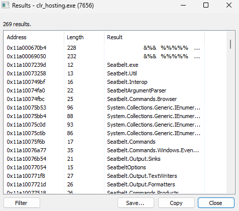
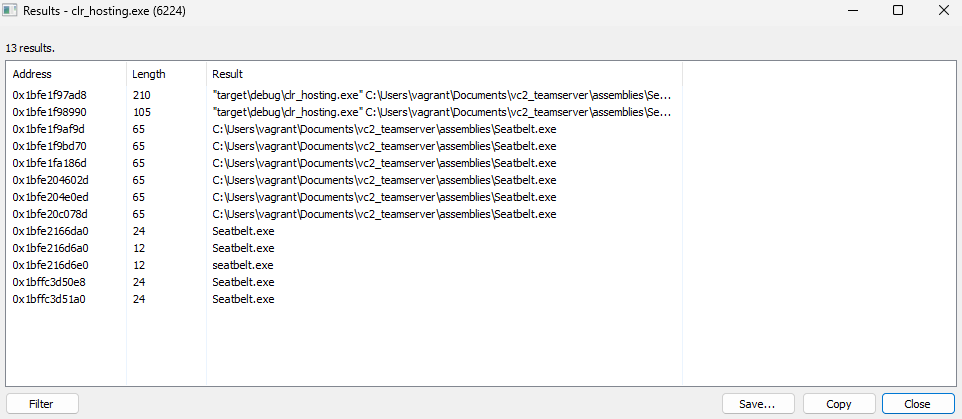

# CLR Heap encryption
This is a POC for a CLR sleep obfuscation attempt. It use `IHostMemoryManager` interface to control the memory allocated by the CLR. Turns out you can use both `ICorRuntimeHost` and `ICLRRuntimeHost` at the same time, so we can still use `ICorRuntimeHost` to run an assembly from memory while having all the benefits from `ICLRRuntimeHost`.

Without CLR Heap encryption:

With:

Code is poorly written, this is just a POC for fun.

## References
* https://github.com/yamakadi/clroxide
* Konrad Kokosa, Pro .NET Memory Management
* https://github.com/etormadiv/HostingCLR/tree/master/HostingCLR
* https://github.com/HavocFramework/Havoc
* https://www.mdsec.co.uk/2023/05/nighthawk-0-2-4-taking-out-the-trash/
* http://www.ahuwanya.net/blog/post/enumerating-appdomains-from-a-clr-host